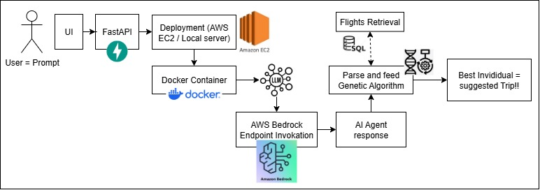
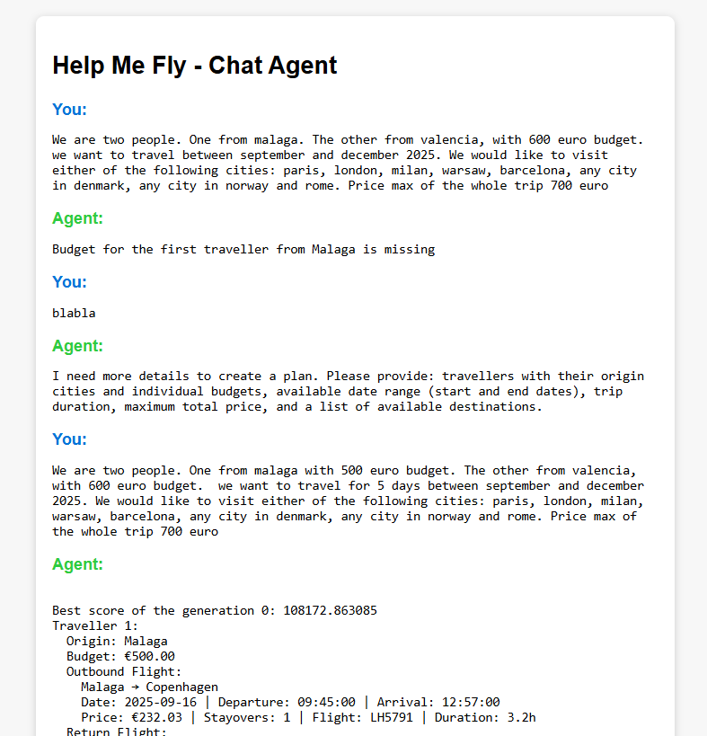
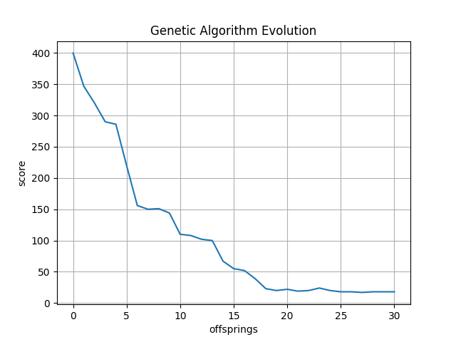

# HELP ME FLY
## Introduction
Application which intends to ease the search of flights. With the break-out of LLM into quotodian usage, talking to an AI-Agent should be enough to find your perfect flight demand. No more drop-down menus, pop-up calendar, nor checkboxes. Just talk.
Addionally, employing metaheuristic techniques, the API can design the perfect flight-trip for multiple travelers departing from different cities (i.e. each of your friends lives in a different city and regardless you want to meet in a city matching your budget and approximate dates).

>[!IMPORTANT]
> Currently there is NOT even one REST API cost-free to retrieve flights, so I have included a script which simulates thousand "API request-respose" in JSON format and stores it into a SQL database.

## Scope
Design an AI Agent based on LLM. Since this requires high computer power I will leverage AWS Bedrock services to use a pretrained model.
Metaheuristic-based algorithm to converge into an optimal solution which suits user/s requirements.

## Stack
- Python
- Pydantic
- AWS Bedrock
- REST API - Flask/FastAPI
- WebSockets
- Async

## Workflow


## DEMO
### Real scenario tested on the agent
Simple user interface (FastAPI + HTML)


In case the Agent misses information for completing the Trip Plan it lets the user know.
When the query contains all necessary parameters it generates a JSON-like string that can be parsed in the codeflow and eventually injected as class instances.

Thanks to LLM the workflow is dynamic.

Valid User query

> "Talk with the agency: we are two people. One from Malaga with 500 euro budget. The other from Valencia, with 600 euro budget. 
we want to travel for 5 days between september and december 2025. We would like to visit either of the following cities: paris, london, milan, warsaw, barcelona, any city in denmark, any city in norway and rome. Price max of the whole trip 700 euro"

Response:
```json
{
  "listTravellers": [      
    {
      "origin": "Malaga",  
      "budget": 500.0      
    },
    {
      "origin": "Valencia",
      "budget": 600.0      
    }
  ],
  "travelPlan": {
    "fromDate": "2025-09-01",
    "toDate": "2025-12-31",
    "vetoCities": null,
    "preferredCities": null,
    "priceMax": 700,
    "days": 5,
    "allowStayover": true,
    "availableDestinations": ["Paris", "London", "Milan", "Warsaw", "Barcelona", "Copenhagen", "Oslo", "Bergen", "Aarhus", "Aalborg", "Odense", "Stavanger", "Trondheim", "Tromsø", "Rome"]
  }
}
```

The AGENT response is used to build the Plan instance, which is fed to the Genetic Algorithm.

We can see the example of how from the Agent we can generate code (plan_json is the agent response)
```python
def buildPlan(plan_json):
    """
    plan json is the output of the Agent which parametrizes the user' query
    into Traveller and TravelPlan
    """
    travellers_json = plan_json["listTravellers"]
    travellers = []

    for traveller_json in travellers_json:
        travellers.append(Traveller.model_validate(traveller_json))

    travel_json = plan_json["travelPlan"]
    travel_plan = TravelPlan(
        fromDate=datetime.strptime(travel_json["fromDate"], "%Y-%m-%d").date(),
        toDate=datetime.strptime(travel_json["toDate"], "%Y-%m-%d").date(),
        vetoCities=travel_json.get("vetoCities"),
        preferredCities=travel_json.get("preferredCities"),
        priceMax=travel_json.get("priceMax"),
        days=travel_json.get("days"),
        allowStayover=travel_json.get("allowStayover"),
        availableDestinations=travel_json.get("availableDestinations")
    )
    
    return Plan(
        listTravellers=travellers,
        travelPlan=travel_plan
    )

```


With the foundations stablished, the GA starts to evolve, storing the best individual from each offspring.
After the determined number of generations, we can see how the algorithm is converging:


The first suggestions are usually pretty bad, cause they come from randomization. After few offsprings, the algorithm starts pointing to better solutions.

Suggested trip:

```
Chosen destination: Rome

Traveller 1:
  Origin: Malaga
  Budget: €500.00
  Outbound Flight:
    Malaga → Rome
    Date: 2025-11-24 | Departure: 18:45:00 | Arrival: 19:51:00
    Price: €10.59 | Stayovers: 1 | Flight: SK4053 | Duration: 1.1h
  Return Flight:
    Rome → Malaga
    Date: 2025-11-29 | Departure: 20:15:00 | Arrival: 01:15:00
    Price: €37.10 | Stayovers: 0 | Flight: SK3668 | Duration: 5.0h
  Total Route Cost: €47.69

Traveller 2:
  Origin: Valencia
  Budget: €600.00
  Outbound Flight:
    Valencia → Rome
    Date: 2025-11-24 | Departure: 21:00:00 | Arrival: 23:54:00
    Price: €186.41 | Stayovers: 0 | Flight: KL7241 | Duration: 2.9h
  Return Flight:
    Rome → Valencia
    Date: 2025-11-29 | Departure: 20:45:00 | Arrival: 23:57:00
    Price: €253.35 | Stayovers: 1 | Flight: LO1863 | Duration: 3.2h
  Total Route Cost: €439.76
```
